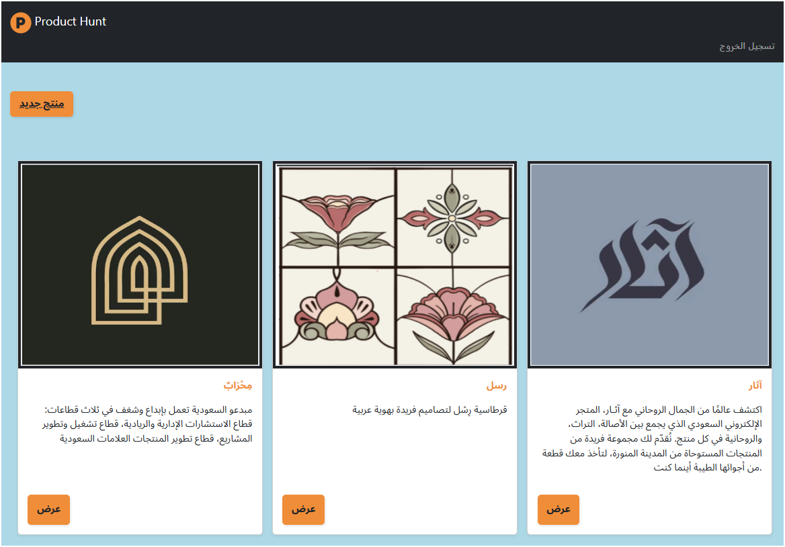
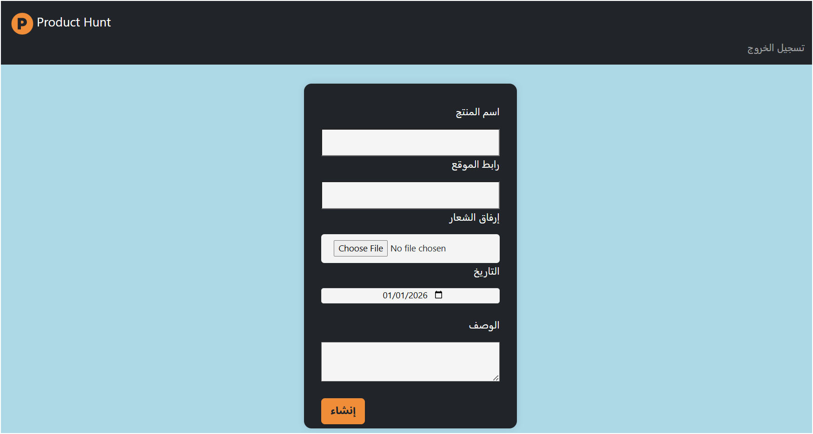

# Product Hunt Website

A simple Django web application for saving and organizing online shops and social media accounts that I purchase from.

The project allows users to:
- Create an account and log in
- Add products or store information
- Upload product/store images
- Save store links and descriptions
- View products in a clean card layout
- Manage their own product list

## Technologies Used

- Python
- Django
- HTML
- CSS
- Bootstrap
- JavaScript
- SQLite

## Features

- User Authentication
- Session Management
- Dynamic URLs
- Image Upload
- Bootstrap UI Design
- Success and Error Messages
- Responsive Product Cards

## Project Purpose

This project was built from scratch as a personal learning project to improve my Django web development skills and practice building a full-stack web application.

